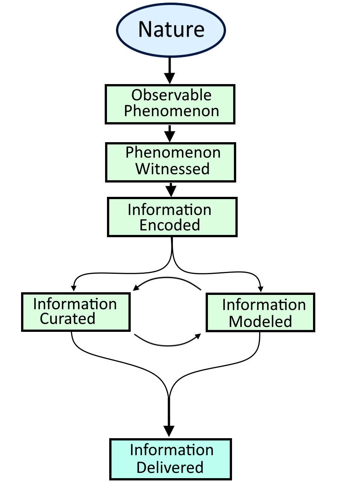

```{r setup, include=FALSE}
options(htmltools.dir.version = FALSE)
```

```{r xaringan-themer, include=FALSE, warning=FALSE}
library(xaringanthemer)
style_duo_accent(
  primary_color = "#1381B0",
  secondary_color = "#FF961C",
  inverse_header_color = "#FFFFFF",
  text_font_google = google_font("Poppins")
)
style_duo_accent
xaringanExtra::use_xaringan_extra()
```

# Welcome to Election Data Science!

- Here's what we're gonna talk about.

---

# What Is Data Science **To You?**
```{r xaringan-editable, echo=FALSE}
xaringanExtra::use_editable(expires = 1)
```

.can-edit.key-likes[
- What do y'all think?

]

???
Spend maybe 5 minutes on this.
---

# What Does Data Science Mean?

--

```{r pic1, echo=F, fig.align = "center", out.width= "50%"}
knitr::include_graphics('pic1.png')
```

--
- It's a new field, but also not?

--
- Instead it's helpful to think of data science not as a rigid field but as a *constellation* of competencies. 

???
- Can trace its intellectual origins to the 1950s and 60s.
- A lot of the techniques used have been theorized for decades but we lacked the computational power
- As a term it's really only come about over the last 15 or so years.
  - That term has changed meanings.
- Because of that, a lot of people think that "Data Science" is just a sexy new way to describe "Applied statistics." 

---
class: center, middle

.bg-washed-green.b--dark-green.ba.bw2.br3.shadow-5.ph4.mt5[
These competencies guide practitioners in the art of *constructing narratives* resting upon information *curated* and *synthesized* from machine-readable data.]  

???
- "narrative" is kind of a bing word but throughout the semester, you'll see that it's
actually the perfect way to describe what it is we do.
---
class: center, middle
```{r pic2, echo=F, fig.align = "center", out.width= "60%"}
knitr::include_graphics('pic2.png')
xaringanExtra::use_tachyons()
```
--
.bg-washed-red.b--dark-red.ba.bw2.br3.shadow-5.ph4.mt5[
Except this is wrong]

---
# What's missing?

--

.pull-left[
- *Domain Expertise.*
- *User Experience (UX) and Design*
- *Ethics*
- *Social Theory*
- **and more...**]

--

.pull-right[]


---

# 3 Main Approaches to Data Science
--

1. **Data Exploration:** 
  - Looking for correlations and correspondences between different data objects.
  - Used to segment voters by issue, explore results and turnout patterns, etc.

--

2. **Prediction:**
  - Using data about what *has* happened (or is happening) to predict what *will* happen.
  - Turnout predictions, likely voter models, etc.
--

3. **Causal Inference:**
  - Going *deeper* than association. Seeing if two (or more things) are causally linked.
  - Do campaign adverts *actually* work? When and for whom?
  - Most commonly aped. Not most commonly done.]


???
A fourth approach is to build the tools that we need for the other 3.
In my personal opinion, the thing that separates bad/good data scientists from good/great ones are two things

---
# 2 Big Things

--

.pull-left[
1. A drive to continuously learn.
  - There are always new techniques to learn.
  - There is always new, helpful knowledge to be gained.
  - But it's deliberate, purposeful learning. 
2. Deep consideration of the **D.G.P**
  - **D**ata **G**eneration **P**rocess.]


.pull-right[]


---
# The DL on the DGP

```{r, echo=FALSE, out.width="40%", fig.align='center'}

```

???
At every stage of the process, there is not only the opportunity for human error, but there is unavoidable informational limits that are basically set by reality.

- For example: Does nature generate the phenomenon if human events have catalyzed it? How much of it is due to how things are versus how we set them up to be? 
- How is the phenomenon witnessed? Some things aren't even witnessable unless you look at it with the right perspective. 
- Then you get into things like sampling frames, selection, etc. Where is the information even coming from?
- Information encoding runs up to issues with floating point numbers because our computers are all ultimately based around base two. On the human end of things continuous phenomena are discretized. 
- Some information is nixed. Or it's simplified. Or it's framed a certain way.
- Sometimes you get aggregated data, or data that has undergone a more advanced procedure.
- By the time information has been delivered to you, ready to import into R and analyze, it is irreparably different than how "nature" generated it.
- Then once you analyze it you can still mess up. 


---
class: center, middle
.bg-washed-red.b--dark-red.ba.bw2.br3.shadow-5.ph4.mt5[
You need to get in the habit of **knowing** that your data are invariably *wrong.* They will carry bias---some obvious, some subterranean. Data are always mere **_approximations_** of nature.]

???
We have a word for constructing simplifications out of messy realities with the intention of someone, somewhere, getting something useful out of it: Telling stories. The models we provide are stories that we tell. 
---
class: center, middle
# All models are *fictions*. Some fictions are *illuminating*.

---
# What you are *not* going to learn in this class

--

.pull-left[
**Important technologies:**
  - Python
  - SQL
  - AWS/Google/Azure cloud computing
  - Tableau
  - Docker
]
.pull-right[
**Important concepts:**
  - Calculus
  - Matrix algebra
  - Neural networks
  - Natural language processing (NLP)
  - Neural networks and "deep" learning
]
--
<br>
<br>
<br>
<center>**And more**

---
# What you *are* going to learn (at least I hope).

- Programming languages are just that--*languages*
  - So is maths, for that matter.
- Computers are the dumbest kind of magic.
- Data **never** speak for themselves.
- As data professionals, you have an inherent obligation to be ethical in your handling of data and in your presentation of your results. Every point is a *person.* Every narrative impacts **real people.**
- Analytical procedures never make anything *objective.* Objectivity is not a thing that actually exists. (Or, at the very least, is not attainable by us mere mortals.)
- All data are artifacts of the time, place, people, and culture they are generated from. There meanings are laden with this context.