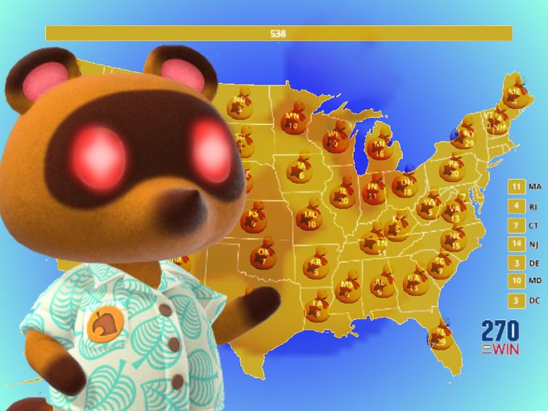

```{r setup, include=FALSE}
options(htmltools.dir.version = FALSE)
```

```{r xaringan-themer, include=FALSE, warning=FALSE}
library(xaringanthemer)
style_duo_accent(
  primary_color = "#1381B0",
  secondary_color = "#FF961C",
  inverse_header_color = "#FFFFFF",
  text_font_google = google_font("Poppins")
)

xaringanExtra::use_xaringan_extra()
library(tidyverse)
library(kableExtra)
```

```{css, echo=FALSE}
pre code, pre, code {
  white-space: pre !important;
  height: 100px !important;}
```

--

```{r, echo=F, fig.align='center', out.width="50%", fig.cap="My prediction"}


```

---
# What we're learning today:
--

1. Cluster analysis
2. Principal component factor analysis
--

3. The intuition for unsupervised exploratory methods, more generally.

---
#Let's tie this into machine learning.

.pull-left[
- There are two\* kinds of machine learning algorithims:
  - **Supervised**
  - **Unsupervised**

- We spent the last two weeks talking about algorithms and tools that fall under the *supervised* umbrella.
- For exploration, we're going to talk about a couple prominent things that fall under the *unsupervised* umbrella.
]

.pull-right[
```{r, echo=F, fig.align='center', out.width="50%"}
knitr::include_graphics("https://miro.medium.com/max/625/1*x7P7gqjo8k2_bj2rTQWAfg.jpeg")
```
]

---
#What's the difference?

.pull-left[
<center><strong>Supervised</strong></center>

- Some kind of ex ante classification or labeling of the data.
  - A person has labeled this observation as a "voter", has inputted how much money they've donated, has determined this picture is a cat, etc.
- Usually a closed-form solution (or relatively consistent algorithm.)
]
.pull-right[<center><strong>Unsupervised</strong><center>

- The data <em>itself</em> provides the information\* that creates the categories. 
- Solutions are usually algorithmic, although some relatively consistent solutions exist.]

--
<center><em>The main way these algorithms ascertain groups is through some conception of <strong>distance</strong></em></center>

---
# Cluster analysis. 
.pull-left[
- Set of observations exist, defined by multiple dimensions.
  - In this case 2.
- The algorithm does 2 things:
  1. Defines the center of clusters. 
  2. Classifies data based upon proximity to the center.
- *You have to define the number of clusters.*
  - There are techniques if you don't know the cluster center, though.
]


.pull-right[
```{r, echo=F, fig.align='center', out.width="80%"}
knitr::include_graphics("https://bookdown.org/rdpeng/exdata/images/kmeans-unnamed-chunk-2-1.png")
```
]

---
# But let's expand our minds about what we mean by "distance"
```{r, echo=F, fig.align='center', out.width="50%", fig.cap="My prediction"}


```

---
.bg-washed-blue.b--dark-blue.ba.bw2.br3.shadow-5.ph4.mt5[
Normally by distance, we think euclidean distance ($Y = \sqrt{x^2 + z^2}$)--and that's a totally valid way. But distance can be thought of as simply a measure of *association.* And association can *also* be measured by how much variables **correlate** and/or **covary** with each other.
] 

---
# Principal Components Analysis (PCA): Intuition.

.pull-left[
- Set of observations exist, defined by multiple dimensions.
  - PCA is part of a family of *dimension reduction* techniques. Meaning it helps you take many variables and bring it down to fewer.
- Takes your data, decomposes it, and identifies vectors explaining the maximum amount of variance.
  - These are called factors.
  - Different variables will load onto the same factor.
  - 
]


.pull-right[
```{r, echo=F, fig.align='center', out.width="80%", fig.cap="Source: Boehmke & Greenwell"}
knitr::include_graphics("https://bradleyboehmke.github.io/HOML/15-pca_files/figure-html/create-pca-image-1.png")
```
]

---
#PCA: In practice.

```{r, echo=FALSE, fig.align='center', out.width="60%"}
knitr::include_graphics("pca.png")
```


