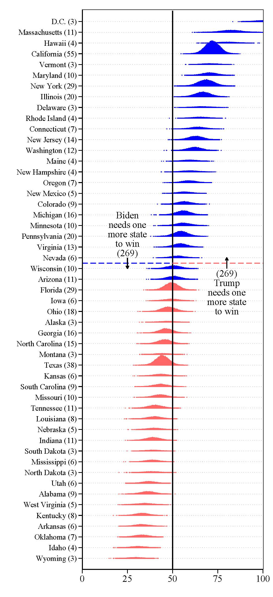

```{r setup, include=FALSE}
options(htmltools.dir.version = FALSE)
```

```{r xaringan-themer, include=FALSE, warning=FALSE}
library(xaringanthemer)
style_duo_accent(
  primary_color = "#1381B0",
  secondary_color = "#FF961C",
  inverse_header_color = "#FFFFFF",
  text_font_google = google_font("Poppins")
)

xaringanExtra::use_xaringan_extra()
library(tidyverse)
library(kableExtra)
```

```{css, echo=FALSE}
pre code, pre, code {
  white-space: pre !important;
  height: 100px !important;}
```

--

*Passphrase is: *

---
# What did you expect to happen?
--

```{r, fig.align='center', echo=F, fig.cap="My (actual) prediction."}
knitr::include_graphics("https://www.awildpoliticalnerd.com/post/2020-11-03-some-thoughts-about-the-2020-election_files/likelyoutcome.png")
```
---

#Lol
```{r, fig.align='center', echo=F, fig.cap="Written November 3rd"}
knitr::include_graphics("whatwrong.png")
```

---
# What did you expect to happen?

---

We're not going to truly **know** *anything* for quite some time. But there are a few things that seem to be fairly clear:
--

1. Trump outperformed the polls in virtually every state and across the nation. (The source of error(s) is unclear.)
3. *A lot* of people expected a blowout that never materialized. 
--

.pull-left[
```{r, fig.align='center', echo=F, out.width="80%"}
knitr::include_graphics("wtfleft.png")
```
]
.pull-right[
```{r, fig.align='center', echo=F, out.width="70%"}
knitr::include_graphics("wtfright.png")
```
]
---
#ALSO! Quick PSA

```{r, fig.align='center', echo=F, out.width="55%", fig.cap="FRIENDS DON'T LET FRIENDS MAKE SUBGROUP JUDGEMENTS ON UNWEIGHTED EXIT POLLS"}
knitr::include_graphics("exitpoll.png")
```

---
# Why might people have expected a blowout?
--

1. **On the right:**
  - Partisan reasoning leading to a repudiation of mainstream information sources.
2. On the left:
  - Partisan reasoning aspirationally interpreting "best case" scenarios as "likely"
  - But also:
--

```{r, fig.align='left', echo=F, out.width="50%"}
knitr::include_graphics("econfinal.png")
```

---
# Is this a fair indictment, though?
```{r, fig.align='center', echo=F, out.width="55%"}
knitr::include_graphics("probability.png")
```

---
class: middle

.bg-washed-blue.b--dark-blue.ba.bw2.br3.shadow-5.ph4.mt5[
At the same time, when you are creating things for *public consumption* you need to take into account how the public **in fact** consumes the kinds of things you are producing. 
]

---
# Best uncertainty visual I saw
```{r, fig.align='center', echo=F, out.width="25%", fig.cap="Source: Peter K. Enns"}

```


---
class: middle, center
# What do you think? Do you see a value in election projections?
