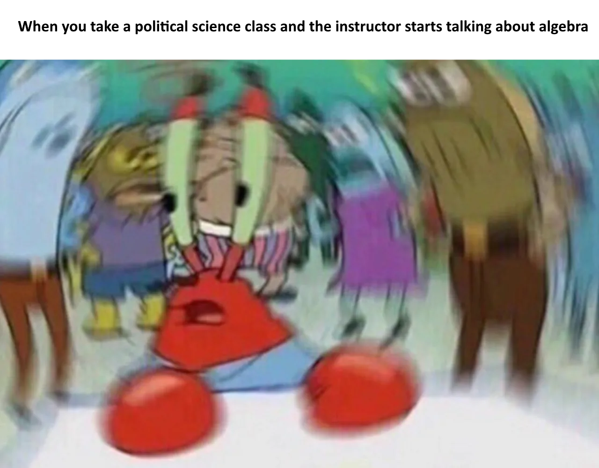

```{r setup, include=FALSE}
options(htmltools.dir.version = FALSE)
```

```{r xaringan-themer, include=FALSE, warning=FALSE}
library(xaringanthemer)
style_duo_accent(
  primary_color = "#1381B0",
  secondary_color = "#FF961C",
  inverse_header_color = "#FFFFFF"
)

xaringanExtra::use_xaringan_extra()
```
class: center, middle
# Welcome! 

---
class: center, middle
--
# Y'all are gonna help me make my lunch.

---
# The challenge:

--
- You guys are going to break out into two groups. Each will have:

--
  - An instruction writer.

--
  - An instruction reader.

--
- You have five minutes to write me instructions for how to make a peanut butter jelly sandwich.

---


---
class: center, middle

# Congratulations! You just wrote an algorithim!

--
.bg-washed-green.b--dark-green.ba.bw2.br3.shadow-5.ph4.mt5[
**Per Wikipedia:** Algorithims are simply "finite sequences of well-defined steps typically used to solve a problem or some class of problems."] 

???
In this case, the problem happened to be that I was gonna be hungry. But in data science, the problem is often how to make the data ready for later analysis and then how to do the analysis by itself. 

As y'all can see from the sandwiches, the emphasis is really on the "well-defined" part.


The algorithm was expressed in english, compiled and evaluated by me and my brain--but in this class we're gonna be using code. Specifically R code.

---
class: middle, center

# To understand coding in R, there's a concept we need to revisit.

--

$f(x)$

---

class: center, middle
```{r pic1, echo=F, fig.align = "center", out.width= "50%"}

```
--
I promise, it's gonna be ok.

---
# Can't have "functions" without "fun"! (I'm so sorry)

- Normally when you see functions, it's often in the context of something like this:

--

  - $f(x) = x^2-1$
  - Say x is 2. Then $f(2) =2^2 - 1 = 3$ 

- But we have to think **broader.**

--

- *Functions* are actually a set of steps that takes an inputted object and performs a transformation on it.
  - *transformations* are simply a sequence of pre-defined steps where actions are perfomed upon the input, resulting in an output.

---
# Objects can also be generalized.

--

- **Single numbers aren't the only thing that can be input into a function.**
--
  - This is what happens when you make a graph out of a mathematical equation.
  - You're (usually) passing all possible values of $x$ into $f(x)$ and plotting the outputted value.
  - Or at least all values within a set range. 

--

- **But you can also make functions for non-numeric objects.**
  - A function that takes "cucumbers" , "apples", and "bananas" and rearranges them alphabetically.
    - The list of fruit are an *object*; the function takes the object and then spits out a transformation.
--

- **You can also make functions for groups of objects (which are, themselves, objects)**
  - Function that takes a matrix 	$\begin{pmatrix} 1 & 2 & 3 \\ 4 & 5 & 6 \end{pmatrix}$ and halves all odd numbers.
    - The matrix as a whole is an *object*; the function works on the elements within the object and transforms them.

---
class: middle

.bg-washed-blue.b--dark-blue.ba.bw2.br3.shadow-5.ph4.mt5[
To understand programming in R, two slogans are helpful:

* Everything that exists is an object.
* Everything that happens is a function call.

.tr[
— John Chambers
]] 

---
class: center, middle

**When you do data science in R, your task is to use preexisting functions (and sometimes create your own!) in ways that take the desired objecs (i.e., "data") and transforms them so that they are usable and useful for later analyses.**

--
*In so doing, you define the steps that you want the data to go through---the order and scope of the transformations. It is very easy for things to go awry and for you to end up with something completely different than what you thought when you sat down and started. So you have to be conscious and deliberate in your steps, and in your coding, or else your analyses will be plagued by otherwise avoidable errors.*