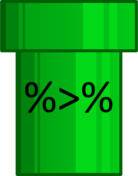
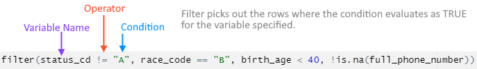

class: center, middle
```{r setup, include=FALSE}
options(htmltools.dir.version = FALSE)
```

```{r xaringan-themer, include=FALSE, warning=FALSE}
library(xaringanthemer)
style_duo_accent(
  primary_color = "#1381B0",
  secondary_color = "#FF961C",
  inverse_header_color = "#FFFFFF",
  text_font_google = google_font("Poppins")
)

xaringanExtra::use_xaringan_extra()
library(tidyverse)
library(DT)
```


It's good to learn about a bunch of wrangling techniques and practices---and you will, given time---but I wanted to walk you through the the most common ones (at least in my experience). 

---
# Most common `tidyverse` (`dplyr`) wrangling functions

* `filter`
* `mutate` & `case_when`
* `group_by` & `summarise`
* `select`
* `join`
* `across`
* `pivot`

---

# But first, let's talk about pipes.
```{r, fig.align = "center", fig.cap="Let's-a go!", echo=FALSE}

```


---
When you write out code in your R script (or R markdown chunk) you'll often do a number of steps:

--
```{r, eval=FALSE, include=TRUE}
data
data1 <- select(data, var1, var2, var3)
data1 <- filter(data1, var1 > 7)
data1 <- mutate(data1, var4 = var2 / var3)
```
--

**There are redundancies in each step that makes errors more likely.**

---

#Use `%>%` instead!
```{r, eval=FALSE, include=TRUE}

data1 <- data %>%
  select(var1, var2, var3) %>%
  filter(data1, var1 > 7) %>%
  mutate(data1, var4 = var2 / var3)

```

--

When reading through the code, replace `%>%` with the phrase "*and then, with the same dataframe.*"

--

Bonus! `%>%` doesn't just work with `tidyverse` functions. As long as your custom-functions include an input for dataframes/matrices/tibbles, you can chain them in as well!

---

# If you want to follow along: 

```{r, eval=FALSE}
#Set your working directory
setwd("your/directory/here")

# Voter registration records Tyrell County NC
url1 <- "https://s3.amazonaws.com/dl.ncsbe.gov/data/ncvoter89.zip"
download.file(url1, destfile = paste0(getwd(),"/voterfile.zip"))  
unzip("voterfile.zip")
file.rename(from = "ncvoter89.txt", to = "voterregistration.txt")

# Voter history files Tyrrell County NC
url2 <- "https://s3.amazonaws.com/dl.ncsbe.gov/data/ncvhis89.zip"
download.file(url2, destfile = paste0(getwd(),"/voterhistory.zip"))  
unzip("voterhistory.zip")
file.rename(from = "ncvhis89.txt", to = "voterhistory.txt")

# Load in data
TY_Records <- readr::read_delim("voterregistration.txt", delim = "\t")

TY_History <- readr::read_delim("voterhistory.txt", delim = "\t")

```

```{r include=FALSE}
TY_Records <- readr::read_delim("voterregistration.txt", delim = "\t")

TY_History <- readr::read_delim("voterhistory.txt", delim = "\t")
```


---
# Filter

.panelset[
.panel[.panel-name[The Code]

```{r}
TY_Records_Filt <- TY_Records %>%
  filter(status_cd != "A", race_code == "B", birth_age < 40, !is.na(full_phone_number))

```
]
.panel[.panel-name[How it Works]

```{r, fig.align = "center",  echo=FALSE}

```

]
.panel[.panel-name[Output]

```{r echo=FALSE}
TY_Records_Filt <- head(TY_Records_Filt) %>%
  relocate(voter_reg_num, status_cd, race_code, birth_age, full_phone_number)

knitr::kable(TY_Records_Filt)

```
]
]