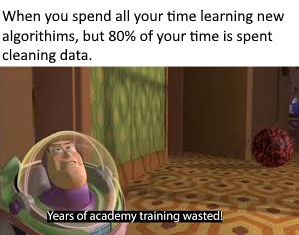

```{r setup, include=FALSE}
options(htmltools.dir.version = FALSE)
```

```{r xaringan-themer, include=FALSE, warning=FALSE}
library(xaringanthemer)
style_duo_accent(
  primary_color = "#1381B0",
  secondary_color = "#FF961C",
  inverse_header_color = "#FFFFFF",
  text_font_google = google_font("Poppins")
)

xaringanExtra::use_xaringan_extra()
```
--

The fact is, most of your time will be spent cleaning data and preparing data *for* analysis, rather than **doing** the analysis.

--
```{r pic1, echo=F, fig.align = "center", out.width= "60%"}

```

---

# Data wrangling

```{r pic2, echo=F, fig.align = "center", out.width= "50%", fig.cap="Image Credit: [Allison Horst](https://github.com/allisonhorst/stats-illustrations)"}
knitr::include_graphics('data_cowboy.png')
```
--

* **Wikipedia:** "Data wrangling, sometimes referred to as data munging, is the process of transforming and mapping data from one "raw" data form into another format with the intent of making it more appropriate and valuable for a variety of downstream purposes such as analytics." 

* **Urban Dictionary:** "The act of consolidating 2 or more mutually exclusive data sets or sections of computer code, circumventing the requirement to write a shit load of complex code."


???
What the urban dictionary one gets that the Wiki doesn't is that the process is meant to help you save yourself from doing a crapton more work than necessary.

---
# Helpful to return back to $f(x)$

--

* $f(1) = 4$. What are the functional steps?
--

  * $f(x) = 4x$
  * $f(x) = 3x + 1$
  * $f(x) = 4 \times \sum_{n=1}^{\infty} ({1\over 2})^n$
  * $f(x) = 4$
--

.bg-washed-blue.b--dark-blue.ba.bw2.br3.shadow-5.ph4.mt5[
There are an infinite number of ways to get a particular output. The *best* ones are the ones that balance **simplicity** (e.g., ease of steps) and **parsimony** (e.g., number of steps).
] 

---

```{r pic3, echo=F, fig.align = "center", out.width= "60%"}
knitr::include_graphics('hex-tidyverse.png')
```

---
# The Tidyverse is a series of packages that helps you wrangle, visualize, and analyze "tidy" data.

--

.bg-washed-green.b--dark-green.ba.bw2.br3.shadow-5.ph4.mt5[
There are three criteria for tidy data:
1. Each variable forms a column.
2. Each observation forms a row.
3. Each type of observational unit forms a table.
.tr[
— Hadley Wickham (2014)
]
] 


---
# Tidy elections data set.

```{r xaringan-panelset, echo=FALSE, message=FALSE, warning=FALSE}
xaringanExtra::use_panelset()
library(tidyverse)
library(DT)
adams <- read_delim("ADAMS.txt", delim = ",")
adams <- head(adams, n = 100L)
```
.panelset[
.panel[.panel-name[Adams County]

```{r echo=FALSE}
datatable(adams, fillContainer = FALSE, options = list(
  scrollX = TRUE,
  scrollY = '200px',
  paging = FALSE,
  autoWidth = TRUE,
  pageLength = 5
))
```
]

.panel[.panel-name[Code]
```{r eval=FALSE, include=TRUE}
#Load needed packages
library(tidyverse)
library(DT)

#Load in Adams County OH voter file (first get it from the SoS)
adams <- read_delim("ADAMS.txt", delim = ",")
adams <- head(adams, n = 100L)

# The html table.
datatable(adams, fillContainer = FALSE, options = list(
  scrollX = TRUE,
  scrollY = '200px',
  paging = FALSE,
  autoWidth = TRUE,

))
```

]
]


---
class: center, middle

**Just because your data is _tidy_ doesn't mean you're done wrangling.** 
--


*Data wrangling is an iterative process that you repeat as new needs emerge in your exploration and analysis.* 

---

# Example: Voters from "West Union"
.panelset[
.panel[.panel-name[Orignal Data]
```{r echo=FALSE, message=FALSE, warning=FALSE}
datatable(adams, fillContainer = FALSE, options = list(
  scrollX = TRUE,
  scrollY = '200px',
  paging = FALSE,
  autoWidth = TRUE,
  pageLength = 5
))
```
]
.panel[.panel-name[Transformation Code]

```{r eval=FALSE, include=TRUE}
Adams_WU <- adams %>%
  filter(RESIDENTIAL_CITY == "WEST UNION")
```

]
.panel[.panel-name[New Table]

```{r echo=FALSE}
Adams_WU <- adams %>%
  filter(RESIDENTIAL_CITY == "WEST UNION")

datatable(Adams_WU, fillContainer = FALSE, options = list(
  scrollX = TRUE,
  scrollY = '200px',
  paging = FALSE,
  autoWidth = TRUE,
  pageLength = 5
))
```


]
]

---

.bg-washed-blue.b--dark-blue.ba.bw2.br3.shadow-5.ph4.mt5[
The best way to wrangle your data is to start at the **end**. What do you want it to look like? What are the steps immediately preceding that final output? How can you get from where you are to those steps? 
] 
