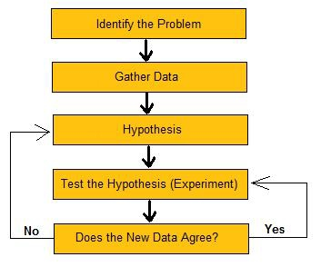

```{r setup, include=FALSE}
options(htmltools.dir.version = FALSE)
```

```{r xaringan-themer, include=FALSE, warning=FALSE}
library(xaringanthemer)
style_duo_accent(
  primary_color = "#1381B0",
  secondary_color = "#FF961C",
  inverse_header_color = "#FFFFFF",
  text_font_google = google_font("Poppins")
)

xaringanExtra::use_xaringan_extra()
library(tidyverse)
library(kableExtra)
```

# Over the last few weeks, we've been talking about how to manipulate and report on data.

--

```{r,echo=FALSE, out.height="200px", fig.align='center'}
knitr::include_graphics("https://i.kym-cdn.com/entries/icons/facebook/000/022/978/yNlQWRM.jpg")

```
--

**A bunch of you are probably also asking this about why you took the class.** 

---

# "Data" is what "data science" is all about.

--

* But if we're going to talk about data *science*, I think it's helpful that we talk about science in the first place.

---
# The scientific method.

--
```{r, echo=FALSE, fig.align='center', out.height="300px", fig.cap="Credit: Get Real Science"}

```

---
# The *real* scientific method.

```{r, echo=FALSE, fig.align='center'}
knitr::include_graphics("https://i.imgflip.com/1itoun.jpg")
```
 ???
 Today's passphrase is conspiracy
---
# No but seriously it's complicated.

--


1. Sometimes you're trying to do something with a testable hypothesis. Othertimes, it's just observation. (And that's science too!)
--

2. You don't usually get to use experiments to test your theories.
--

3. You don't just make a new hypothesis with the same data. Then you're just fishing for results, not uncovering interesting patterns.
--

4. Oftentimes, data collection preceeds the thinking about a question.
--

5. Sometimes your data helps you think through your theory before you officially test the hypothesis.


---

class: middle

.bg-washed-blue.b--dark-blue.ba.bw2.br3.shadow-5.ph4.mt5[
Scratch the surface of the scientific method and the messiness spills out. Even simplistic versions vary from three steps to eleven. Some start with hypothesis, others with observation. Some include imagination. Others confine themselves to facts. Question a simple linear recipe and the real fun begins.

.tr[- Daniel P. Thurs]
] 

---
# Again, why though?
--

- Because if you're going to do data science and dat analytics, you will use data to answer questions. That's it, that's the gig.
--

- But I don't want you thinking that you have to approach data in the rigid way you might have thought science worked. 
--

- To be good at data science, you have to learn to love (if you don't already) gathering data for *all parts* of the scientific endeavor.
--

- **That doesn't mean you can get all your answers from data.** 
  - You should still be supplementing your insights with other forms of information.
  
---
class: middle, center

# So where can I get data?

---

# Some free sources and locations:
- Data packages
- GitHub
- Federal Government (and many state and municipal governments too!)
- Kaggle
- Wikis
- News sites\*
- Public APIs (Twitter, Reddit, Gdelt)
- General Social Survey
- Google Public Datasets
- Pew

---

# Some locations and sources that are free to you as UF students:
- ICPSR
- Roper Center
- Datasets associated with research articles
- LexusNexus
- UF professors.

---
**The main way you'll be reading in data is with `readr` (e.g., `read_csv`, `read_delim`)**
--

*However, don't be afraid of downloading non-tidy and non-rectangular data! There are lots of packages out there to help you get data that don't otherwise exist in pretty data files.*
--

A couple examples: `jsonlite`, `rvest`, `yaml`.

---
# Where and how to become aware of datasets.

- Read. Read a lot. Read a lot more.
- Twitter
- LinkedIn
- Dataisplural news letter.
- Google

---
# When you get new data, it's not enough to simply know where you got it.
--

At the very least, read the documentation so that you know *how* the data was collected.

