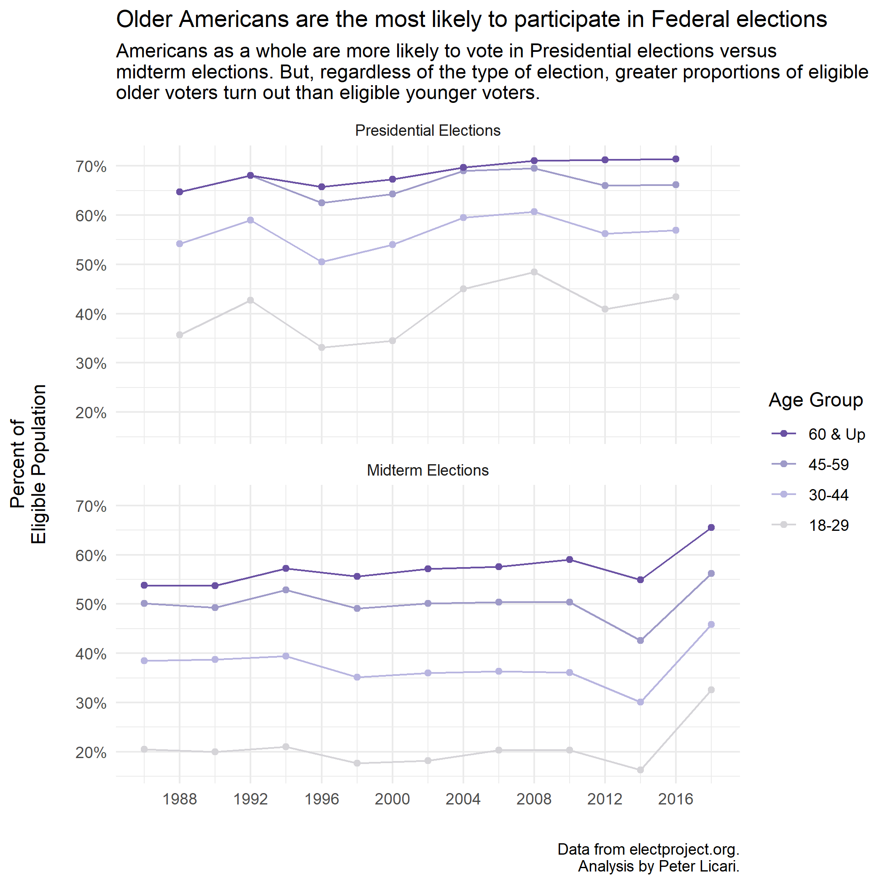

```{r setup, include=FALSE}
options(htmltools.dir.version = FALSE)
```

```{r xaringan-themer, include=FALSE, warning=FALSE}
library(xaringanthemer)
style_duo_accent(
  primary_color = "#1381B0",
  secondary_color = "#FF961C",
  inverse_header_color = "#FFFFFF",
  text_font_google = google_font("Poppins")
)

xaringanExtra::use_xaringan_extra()
library(tidyverse)
library(kableExtra)
```

```{css, echo=FALSE}
pre code, pre, code {
  white-space: pre !important;
  height: 100px !important;}
```


# The best experience is to learn by doing.

--

```{r, fig.align='center', echo=FALSE}

```
--
<br>
<center>*3 lessons by the end of it.*

---
# Here's our renovation project:
--

```{r, fig.align='center', echo=FALSE}
knitr::include_graphics("TurnoutOriginal.png")
```

???

What the heck is going on here?

---

class: center, middle
# Lesson 1: Know your data. 

---

```{r message=FALSE, warning=FALSE}
readr::read_csv("Raw_Turnout_Doc.csv") %>%
  kbl() %>%
  kable_paper() %>%
  scroll_box(width = "800px", height = "250px")
```

---
class: center, middle

# Lesson 2: Know your story. 
---


```{r, fig.align='center', echo=FALSE}
knitr::include_graphics("TurnoutOriginal.png")
```

---

# Let's fix the data so we can tell the story.

```{r message=FALSE, warning=FALSE, class.output = "scroll-100"}
turnout_raw <- readr::read_csv("Raw_Turnout_Doc.csv")

turnout_tidyer <- turnout_raw %>%
  pivot_longer(!`Turnout Rate`, names_to = "Year", values_to = "Percent") %>%
  rename(Age = `Turnout Rate`)
```

```{r, echo=FALSE}    
turnout_tidyer %>%  
  kbl() %>%
  kable_paper() %>%
  scroll_box(width = "800px", height = "250px")
  

```

---
# Preliminary replication

```{r,  fig.align='center'}
 ggplot(data = turnout_tidyer,aes(x = Year, y = Percent, group = Age, color = Age)) + geom_line() + geom_point()
```

---
# Manipulating the Data

```{r, echo = FALSE}
turnout_tidyer %>%  
  kbl() %>%
  kable_paper() %>%
  scroll_box(width = "800px", height = "250px")

```


```{r, class.output = "scroll-100"}
turnout_tidyer <- turnout_tidyer %>%
  mutate(Year = as.integer(Year),
         El_Type = case_when(
           Year %% 4 == 0  ~ "Presidential Elections",
           TRUE ~ "Midterm Elections"
         ),
         Percent = as.numeric(gsub('%',"",Percent))/100)

```

---

# Raw re-design
```{r,  fig.align='center'}
 ggplot(data = turnout_tidyer,aes(x = Year, y = Percent, 
                                  group = Age, color = Age)) + 
  facet_wrap(~El_Type) + 
  geom_line() + geom_point()
```

---
class: center, middle

# Lesson 3: Know Your Audience

---
# Make it readable with your audience in mind.

```{r,  fig.align='center'}
p <- ggplot(data = turnout_tidyer,aes(x = Year, y = Percent, 
                                  group = Age, color = Age)) + 
  facet_wrap(~El_Type) + 
  geom_line() + geom_point() 

p + scale_y_continuous(name = "Percent of Eligible Population",
                     labels = scales::percent_format(accuracy = 1))

```

---

```{r fig.align='center', message=FALSE, warning=FALSE}
p <- p + facet_wrap(~El_Type, ncol = 1)
p
```


---
```{r, fig.align='center'}
p <- p + facet_wrap(~forcats::fct_rev(El_Type), ncol = 1)
p
```


---

```{r, fig.align='center', out.height="400px"}
p <- p + scale_y_continuous(name = "Percent of\nEligible Population\n",
                     labels = scales::percent_format(accuracy = 1))
p
                
```

---
```{r, fig.align='center'}
p <- p + scale_x_continuous(breaks = seq(1988,2020,4), name = "")

p
```

---

```{r, fig.align='center'}
p <- p + theme_minimal()
p
```

---

```{r, fig.align='center'}
p <- p + scale_color_discrete(breaks = c("60","45-59", "30-44","18-29"), name = "Age Group")
p
```

---
```{r fig.align='center', message=FALSE, warning=FALSE, out.height="400px"}
p <- p + scale_color_manual(breaks = c("60","45-59", "30-44","18-29"), name = "Age Group",
                              values = c('#D5D4D8','#B8B5E0','#9e9ac8','#6a51a3'),
                            labels = c("60" = "60 & Up", "45-59"="45-59", "30-44" ="30-44",
                                       "18-29" = "18-29"))
p
```

---
```{r, fig.align='center'}
p <- p + labs(title = "Older Americans are the most likely to participate in Federal elections",
              subtitle = "Americans as a whole are more likely to vote in Presidential elections versus
midterm elections. But, regardless of the type of election, greater proportions of eligible 
older voters turn out than eligible younger voters.",
caption = "Data from electproject.org.\nAnalysis by Peter Licari.")

p

```

```{r include=FALSE}
ggsave("fig1.png")
```

---
#Final Output

```{r, fig.align="center", out.width="70%", echo=FALSE}

```

---
# Comparison
.pull-left[
```{r, fig.align="center", echo=FALSE}

```
]

.pull-right[
```{r, fig.align="center", echo=FALSE}
knitr::include_graphics("TurnoutOriginal.png")
```
]

---
# How were we able to do all of that?

- `ggplot` uses a philosophy called the "grammar of graphics."

- Basically, there isn't a single element on the plot that can't be altered. 

- Things can be built up and layered on top of each other. 

- Different aesthetic elements within your control.

---
# Overall design tips:
--

- Default colors rarely work well.
- Default themes tend to work worse.
- Don't be afraid of white space.
- Don't be afraid of *text* either.
- Know the "rules" (e.g., conventions and metaphors). Once you do, break them.
- People can only focus on 1-3 things in any given plot. Make your takaway still. 
- Tell the story that you want to be told--in images and text both.

