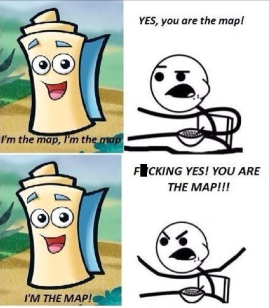

```{r setup, include=FALSE}
options(htmltools.dir.version = FALSE)
```

```{r xaringan-themer, include=FALSE, warning=FALSE}
library(xaringanthemer)
style_duo_accent(
  primary_color = "#1381B0",
  secondary_color = "#FF961C",
  inverse_header_color = "#FFFFFF",
  text_font_google = google_font("Poppins")
)

xaringanExtra::use_xaringan_extra()
library(tidyverse)
library(kableExtra)
library(tmap)
```

```{css, echo=FALSE}
pre code, pre, code {
  white-space: pre !important;
  height: 100px !important;}
```

# Let's talk about maps

--

```{r, echo=FALSE, out.width="50%", fig.align='center'}

```

---

# Mapping is immensely important to elections
--

- Elections are geographically constrained & defined phenomena.
--

- Variety of purposes *pre*- and **post**-election:
  - *Redistricting*
  - *Precinct locations*
  - *Campaigning*
  - *Election-night turnout projections*
  - **_Civil Rights Work_**
  - **Exploring aggregate correlations**
  - **Inferential analysis**
  
---


# Mapping is inherently innaccurate though.
--

.bg-washed-green.b--dark-green.ba.bw2.br3.shadow-5.ph4.mt5[
Not only is it easy to lie with maps, it's essential.

.tr[- Mark Monmonier]
] 

---
# It's inherently part of making maps.

.pull-left[Gauss proved that it was impossible to flatten a sphere so that all of the following 5 elements are maintained:

1. Area
2. Shape
3. Distance
4. Angle
5. Direction
]

.pull-right[
```{r, echo=FALSE, fig.align='center', out.width="50%"}
knitr::include_graphics("https://upload.wikimedia.org/wikipedia/commons/e/ec/Carl_Friedrich_Gauss_1840_by_Jensen.jpg")
```
]
--

<center> *In short, cartographers wish flat-earthers were right.*
---
# Squaring the cirlce (or flattening the sphere)
How do we get maps then?
--

- Geoid models:
  - Models of the earth
  - Develop local datums
--

- Selecting the surface type:
```{r echo=FALSE, fig.align='left', out.width="30%"}
knitr::include_graphics("http://wiki.gis.com/wiki/images/3/3f/Developable_Surfaces.jpg")

```
--

- Selecting projection intent:
  - equal area; conformal; azimuthal; equidistant
  
---
class: center, middle
# Keep in mind that when you map, you are always using a *projection*. And projection choices have consequences.

---
# Do I really need a map?
--

Just because a point has a geographic element doesn't mean your story is about geography.
--

.pull-left[
```{r, echo=FALSE, fig.align='center', out.width="80%", fig.cap="Source: New York Times"}
knitr::include_graphics("counties.png")
```
]
--

.pull-right[
```{r, echo=FALSE, fig.align='center', out.width="50%", fig.cap="Source: FiveThirtyEight"}
knitr::include_graphics("snake.png")
```
]

---
# Provided you do, there are a number of choices you will make:
--

.pull-left[
1. Projection
  - Your distortion of choice. (Good name for a band imho.)
2. Scale
  - Smaller maps are inherently limited in their truth-telling capacity.
3. Included symbols.
  - 6 verbs: color, greyscale, size, direction, texture, and shape.
]
--

.pull-right[
1. Select 
2. Simplify
3. Displace
4. Smoothen
5. Enhance.
6. (Dis)Aggregate
]

---
# The most common maps you will make:

1. Chloropleth maps
2. Point maps.
3. Heat maps
4. Line maps
5. Flow maps
5. Interactive maps.