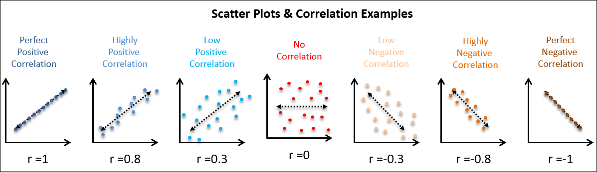

```{r setup, include=FALSE}
options(htmltools.dir.version = FALSE)
```

```{r xaringan-themer, include=FALSE, warning=FALSE}
library(xaringanthemer)
style_duo_accent(
  primary_color = "#1381B0",
  secondary_color = "#FF961C",
  inverse_header_color = "#FFFFFF",
  text_font_google = google_font("Poppins")
)

xaringanExtra::use_xaringan_extra()
library(tidyverse)
library(kableExtra)
```

```{css, echo=FALSE}
pre code, pre, code {
  white-space: pre !important;
  height: 100px !important;}
```
--
```{r, fig.align='center', echo=FALSE}

```
--

*Password today is: Tardis*

---
# There are two primary approaches to statistical analysis of data:

- **Confirmatory data analysis (CDA):** What we think of when we think of the "scientific method."
- **Exploratory data analysis (EDA):** Exploring data for interesting descriptive insights and generating new hypotheses.

---
class: center, middle

.bg-washed-green.b--dark-green.ba.bw2.br3.shadow-5.ph4.mt5[
Exploratory data analysis is less a specific series of steps and more of an attitude of how one approaches the data. At its best, it can help you generate new knowledge, give you more insight into the quality of your data, the appropriateness of your measurements, and help you arrive at new hypotheses for future studies.
] 
 

---
# What kinds of questions to ask?
In the context of election data science/ data-driven social science, you can split it into *single* variable and *multi*variable types.
.pull-left[
<center> <strong>Single Variable Questions</strong></center>

- How many observations are missing? Why?
- What is the largest value? Smallest value? Average value?
- What is the count of values and/or observations?
- Are there outliers? What is generating them?
- What is the distribution of values? 
- Are these things expected?
]

.pull-right[
<center> <strong>Multivariable Questions</strong></center>

- Do values vary across spacial boundaries?
- Do values vary across known groups?
- Do values suggest the presence of **un**known groups?
- Do values x and y covary? Are they correlated?
- Does relationship X occur in this data set?
- Does relationship X hold in condition Y?]

---
# A few statistical terms we should be aware of:

- **Mean:** Arithmatic average; sum of all observations / the number of observations
- **Median:** All values are sorted from lowest to highest; median is the middle value (or mean of middle 2)
  - *If median and mean differ drastically, then your data are most likely skewed*
- **Mode:** Most frequently observed variable.
- **Range** Difference from lowest observed value to highest observed value
- **Quartiles/Deciles:** You know how median is at the 50% mark? Could do it every 25/10 as well.
- **Inner Quartile Range:** Range from the 75% figure to the 25% figure
- **Standard Deviation:** Square root of the mean mean squared distance from the mean value.
  - $S.D. \{1,2,3,4,5\} \rightarrow$
  $\sqrt{((1-3)^2 + (2-3)^2 + (3-3)^2 + (4-3)^2 + (5-3)^2)/5} = 1.581$

---

.pull-left[<center> <strong>What's asked</strong></center>

- How many observations are missing? Why?
- What is the largest value? Smallest value? Average value?
- What is the count of values and/or observations?
- Are there outliers? What is generating them?
- What is the distribution of values? 
- Are these things expected?</strong>
]

.pull-right[
<center> <i>What it can tell us</center>
- How complete is the data? Are there issues in collection?
- Are there surprises? Are there large gaps? 
- Are there discrepancies with other accepted figures?
- Are there apparent violations of laws, norms, and/or desirable procedures/outcomes?
 </i>]

---

# Example: Absentee ballot send date.

```{r echo=FALSE, fig.align='center', message=FALSE, warning=FALSE}
al<-read_csv("ALAMANCE_absentee_20201103.csv")

al %>% mutate(ballot_send_dt = as.Date(ballot_send_dt, format = "%m/%d/%Y")) %>%
ggplot(aes(x =ballot_send_dt))+geom_bar()

```


---
# Example:  Duration from sent to returned.

```{r echo=FALSE, fig.align='center', message=FALSE, warning=FALSE, out.width="80%"}
al %>% mutate(ballot_send_dt = as.Date(ballot_send_dt, format = "%m/%d/%Y"),
              ballot_rtn_dt = as.Date(ballot_rtn_dt, format = "%m/%d/%Y")) %>%
  mutate(duration = (ballot_rtn_dt - ballot_send_dt)) %>%
  ggplot(aes(x = duration)) + geom_density() + labs(title = "Number of days between shipment and return Alamance county.")

```


---
```{r xaringan-editable, echo=FALSE}
xaringanExtra::use_editable(expires = 1)
```
# Before we talk about multivariable relationships...

Let's talk about correlation and covariance.

**What comes to mind when you think of the word "correlation?**

.can-edit[
- thoughts...
]


---
class: center, middle

**Correlation refers to the degree that two variables covary--usually in a linear fashion. It is a proxy for how interdependent they are upon one another--or upon a hidden joint factor.**

```{r, fig.align='center', out.width="60%", fig.cap="Source: Ly Tong", echo=FALSE}

```

---
.pull-left[<center> <strong>What's asked</strong></center>
- Do values vary across spacial boundaries?
- Do values vary across known groups?
- Do values suggest the presence of **un**known groups?
- Do values x and y covary? Are they correlated?
- Does relationship X occur in this data set?
- Does relationship X hold in condition Y?]

.pull-right[
<center> <i>What it can tell us</center>
- Is there a relationship between two concepts/variables?
- Is the relationship heterogenous?
- Are there surprises? Are there large gaps? 
- Are there discrepancies with other accepted figures?
- Are there apparent violations of laws, norms, and/or desirable procedures/outcomes?
 </i>]

---
# Example: 

**Correlation between election challenger feeling thermometer and faith that 2016 was fair.**

.panelset[.panel[.panel-name[Correlation]
```{r, echo=FALSE, }
datasauRus::datasaurus_dozen %>%
  filter(dataset == "dino") %>%
  summarise(Trump_Therm = mean(x), Faith = mean(y), corr= cor(x,y)) %>%
  kbl() %>%
  kable_paper()
```
]

.panel[.panel-name[Figure]
```{r fig.align='center', fig.cap="Bamboozeled!", message=FALSE, warning=FALSE, paged.print=FALSE, echo=FALSE, out.width="80%"}
datasauRus::datasaurus_dozen %>%
  filter(dataset == "dino") %>%
  ggplot()+geom_point(aes(x=x, y=y))
```


]]

---
# Why visualization is such an important part of EDA!

```{r, fig.align='center', echo=F, fig.cap="Credit: RStudio"}
knitr::include_graphics("anscombe.png")
```

---
# Real example

```{r echo=FALSE, fig.align='center', message=FALSE, warning=FALSE, out.width="80%"}
al %>% mutate(ballot_send_dt = as.Date(ballot_send_dt, format = "%m/%d/%Y"),
              ballot_rtn_dt = as.Date(ballot_rtn_dt, format = "%m/%d/%Y")) %>%
  mutate(duration = (ballot_rtn_dt - ballot_send_dt)) %>%
  ggplot(aes(x = duration, fill = voter_party_code)) + geom_density(alpha = .4) + labs(title = "Number of days between shipment and return Alamance county.")
```


---
# How generalizable are the conclusions of EDA?

--

It depends on how good the data are on three factors:
--

1. Scope:
  - *How much of the data, with regards to your population and time period of interest, do you have?*
2. Quality: 
  - *How reliable are the instruments, measures, and data-gathering process?*
3. Specificity:
  - *How well do the measures map on to your question?*
---

```{r, fig.align='center', echo=FALSE}

```


---
# Can EDA Help with causality?

- *Usually not.*
- If the data are gathered at the same time, then you can't necessarily be sure which causes which?
  - Further, there may be a hidden *third* factor, causing both things to occur.
  - Hence why "correlation does not equal causation." (Although, also the reverse is true, depending on your definitions.)
  
---
# Can EDA help make predictive models?
.pull-left[- *Again, usually no.*
- Sometimes it can help you specify models and groups to keep out for. But otherwise it's really irresponsible.]

.pull-right[
```{r, fig.align='center', echo=FALSE}

```

]

---
# What kinds of questions to ask?
Not an exclusive list, but I find a lot of my questions circling one or several of these topics:

- Does it reflect a topic that is underrrepresented in our current collection of knowledge? (*Here's where expertise comes in!*)
- Is there something that you think should matter but that no one has talked about? Or **has** talked about, but not emphasizing particular things you feel matter?
- Is it an attitude about politically relvant groups, issue-areas, and/or individuals?
- It it a belief that holds considerable sway over members of politically notable groups?


---
# Continued.
- Is it the downstream effect of actors/entities/processes that are suspected to have an affect on relevant cognitions and actors?
- Does it represent an important step in the contexts' elections process from a voter's and/or administrator's perspective?
- Does it measure a process that is important for the administration of policy, distribution of (material and non-material) goods, and/or one that plays a role in the allocation of power?
- Is the concept/variable thought to hold leverage in important social, psychological, and/or political processes? 
- Is it interesting and/or fun to learn about?

